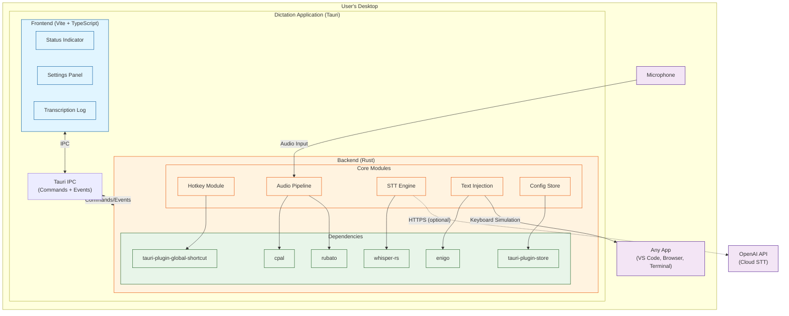
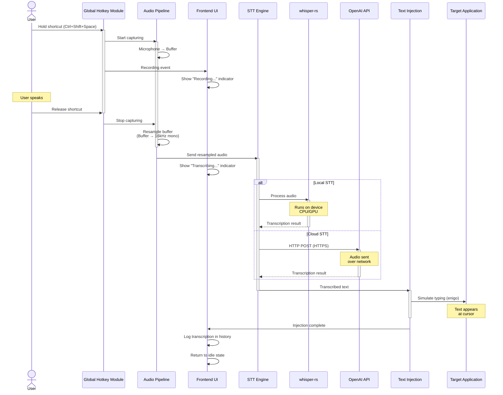
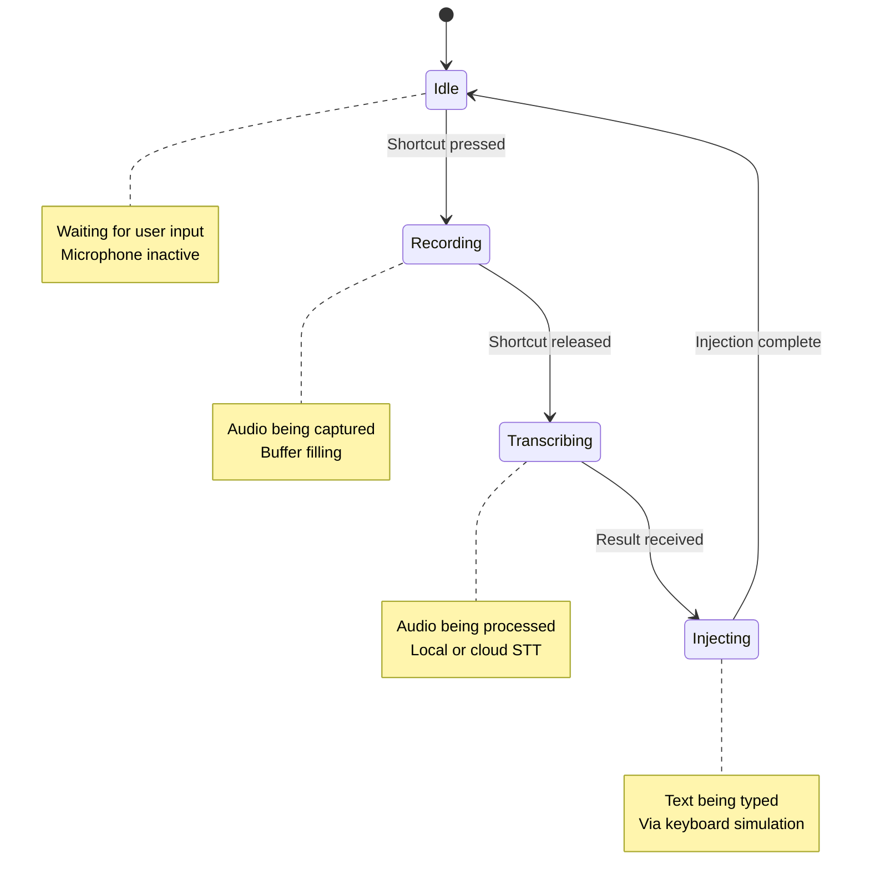

# Architecture Overview

This document provides a high-level overview of the Dictation application architecture.

## System Architecture

## Data Flow: Push-to-Talk Session

## Module Responsibilities

### Frontend (TypeScript)

**Location:** `src/`

- **Status Indicator**: Shows current state (idle/recording/transcribing)
- **Settings Panel**: User configuration UI
- **Transcription Log**: History of recent transcriptions
- **Tauri IPC**: Calls Rust commands, listens to events

### Backend Modules (Rust)

**Location:** `src-tauri/src/`

#### Core

- **lib.rs**: Tauri application builder, plugin registration
- **main.rs**: Entry point, calls `lib::run()`
- **error.rs**: `DictationError` enum with thiserror
- **state.rs**: `AppState` (Tauri managed state)
- **events.rs**: Event name constants and payload types
- **commands.rs**: Tauri command functions (IPC handlers)

#### Feature Modules

- **audio/**: Microphone capture and resampling
  - `capture.rs`: cpal integration
  - `resample.rs`: rubato integration
  - `buffer.rs`: Circular buffer for audio storage

- **stt/**: Speech-to-text engines
  - `trait.rs`: `SttEngine` trait definition
  - `whisper.rs`: Local backend (whisper-rs)
  - `openai.rs`: Cloud backend (OpenAI API)

- **injection/**: Text insertion
  - `keyboard.rs`: enigo keyboard simulation
  - `clipboard.rs`: Fallback clipboard paste

- **hotkey/**: Global keyboard shortcuts
  - `state_machine.rs`: Push-to-talk state management
  - `handler.rs`: tauri-plugin-global-shortcut integration

- **config/**: Settings persistence
  - `settings.rs`: `AppSettings` struct
  - `defaults.rs`: Default values
  - `storage.rs`: tauri-plugin-store integration

## State Machine: Recording Flow

## Technology Stack

### Frontend
- **Build Tool**: Vite 6.x
- **Language**: TypeScript
- **UI**: Vanilla JS (minimal framework)
- **IPC**: @tauri-apps/api

### Backend
- **Framework**: Tauri 2.0
- **Language**: Rust 2024 edition
- **Audio Capture**: cpal 0.15
- **Resampling**: rubato 0.16
- **STT Local**: whisper-rs 0.15
- **STT Cloud**: reqwest 0.12 (OpenAI API)
- **Text Injection**: enigo 0.5
- **Global Shortcuts**: tauri-plugin-global-shortcut 2.3
- **Settings**: tauri-plugin-store 2.4
- **Error Handling**: thiserror 2.0

### Platform Support
- macOS (ARM64 + x86_64)
- Linux (X11 + limited Wayland)
- Windows (planned)

## Security Considerations

1. **Microphone Access**: Requires OS permission, requested on first use
2. **API Keys**: Stored in plaintext JSON (OS keychain planned for future)
3. **Keyboard Simulation**: Requires accessibility permission (macOS)
4. **Network**: HTTPS only for cloud API, certificate validation enabled
5. **Sandboxing**: Tauri's security model with command allowlisting

## Performance Characteristics

- **Audio Buffer**: 30 seconds max (configurable)
- **Latency**:
  - Push-to-talk activation: <50ms
  - Local STT: 1-5s (depends on audio length and model)
  - Cloud STT: 0.5-2s (depends on network)
  - Text injection: ~10ms per character
- **Memory**: ~50-100MB base + model size (500MB-1.5GB for local STT)
- **CPU**: Minimal when idle, high during local transcription

## Future Enhancements

See individual ADRs for detailed discussions of future possibilities:

- Voice activation mode (ADR-004)
- Click-to-toggle interaction (ADR-004)
- OS keychain integration (ADR-006)
- Additional STT backends (ADR-002)
- Wayland support improvements (ADR-005)
- Framework migration if UI complexity grows (ADR-007)

## Related Documentation

- [ADR Index](./adr/README.md) - Architecture Decision Records
- [Build Instructions](../README.md#build-commands) - How to build and run
- [CLAUDE.md](../CLAUDE.md) - Development guidelines for AI assistants
