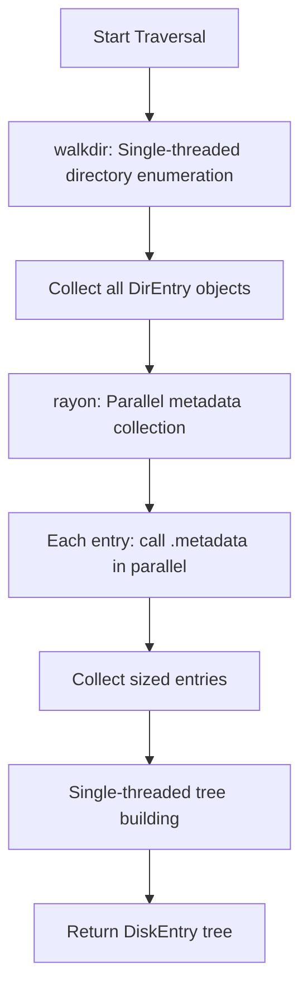
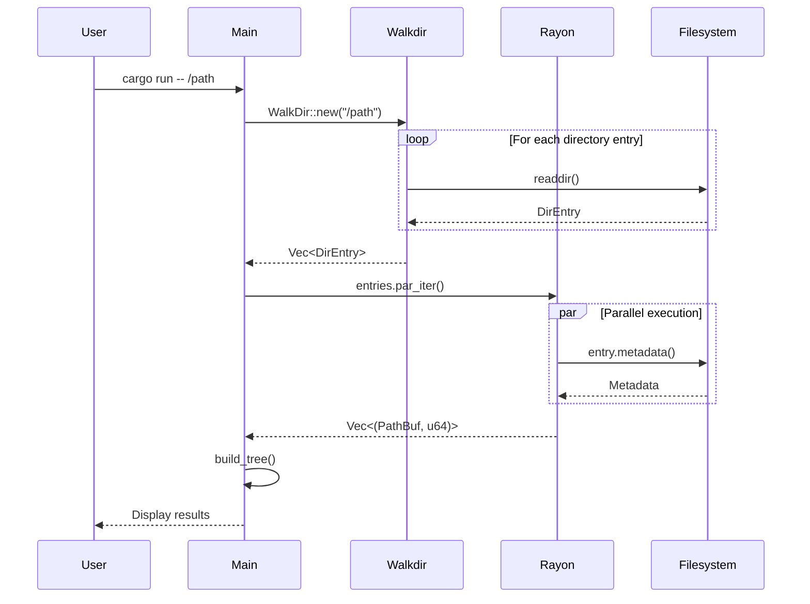

# ADR-001: Multi-Threading Strategy with Walkdir and Rayon

## Status

Accepted

## Context

Disk usage analysis involves two primary operations:
1. Directory traversal - enumerating all files and directories
2. Metadata collection - calling `stat()` syscalls to get file sizes

The performance bottleneck differs based on the operation:
- Directory traversal (`readdir`) is fast but must be sequential due to filesystem API constraints
- Metadata collection (`stat`) can be parallelized as each call is independent

We needed to balance:
- Performance on systems with many small files vs few large directories
- Thread coordination overhead vs parallelization benefits
- Code complexity vs maintainability
- User control over thread count

## Decision

We implemented a hybrid approach:

**Key components:**

1. **Walkdir** for directory traversal (single-threaded)
   - Fast filesystem `readdir` syscalls
   - Respects max-depth settings
   - Follows symlinks appropriately

2. **Rayon** for parallel metadata collection
   - Uses `par_iter()` to parallelize `metadata()` calls
   - Automatically balances work across threads
   - Minimal coordination overhead

3. **User-configurable thread pool**
   - `--threads` / `-j` flag for explicit control
   - Uses `ThreadPoolBuilder` to configure rayon

## Implementation Flow

## Consequences

### Positive

- **Excellent performance**: Parallelizes the slowest operation (stat syscalls)
- **No deadlocks**: Single-threaded walkdir avoids filesystem API limitations
- **User control**: Thread count flag allows tuning for specific environments
- **Simple code**: Rayon's par_iter makes parallelization straightforward
- **Scalable**: Works well on both small and large directory trees

### Negative

- **Memory overhead**: Must collect all entries before parallelizing
- **Not pure streaming**: Cannot output results during traversal
- **Thread pool overhead**: Extra memory for thread coordination
- **Less efficient for few files**: Thread coordination overhead may exceed benefits

### Neutral

- Two-phase approach (collect then process) is clear but less incremental
- Memory usage proportional to number of files in directory tree

## Alternatives Considered

### Alternative 1: Fully Single-Threaded

**Pros**: Simpler code, lower memory usage, streaming output
**Cons**: Poor performance on systems with many files

**Why rejected**: Performance is critical for large directory trees

### Alternative 2: Parallel Directory Traversal

**Pros**: Could parallelize everything
**Cons**: Complex synchronization, filesystem APIs don't support concurrent readdir well

**Why rejected**: Complexity outweighs benefits; readdir is already fast

### Alternative 3: Thread-per-Directory

**Pros**: Natural parallelism boundary
**Cons**: Unbalanced work distribution, thread spawn overhead

**Why rejected**: Rayon's work-stealing provides better load balancing

## Performance Characteristics

Based on the implementation:

| Scenario | Performance | Reason |
|----------|------------|--------|
| Many small files | Excellent | Parallel stat calls dominate |
| Few large directories | Good | Fast sequential readdir |
| Deep nested structure | Good | Max-depth limiting helps |
| Network filesystems | Excellent | Parallel I/O hides latency |

## Notes

- The `--threads` flag allows users to tune for their specific hardware
- Rayon's work-stealing ensures good CPU utilization
- Single-threaded tree building is fast compared to I/O operations
- Tests verify both sequential and parallel modes produce identical results
