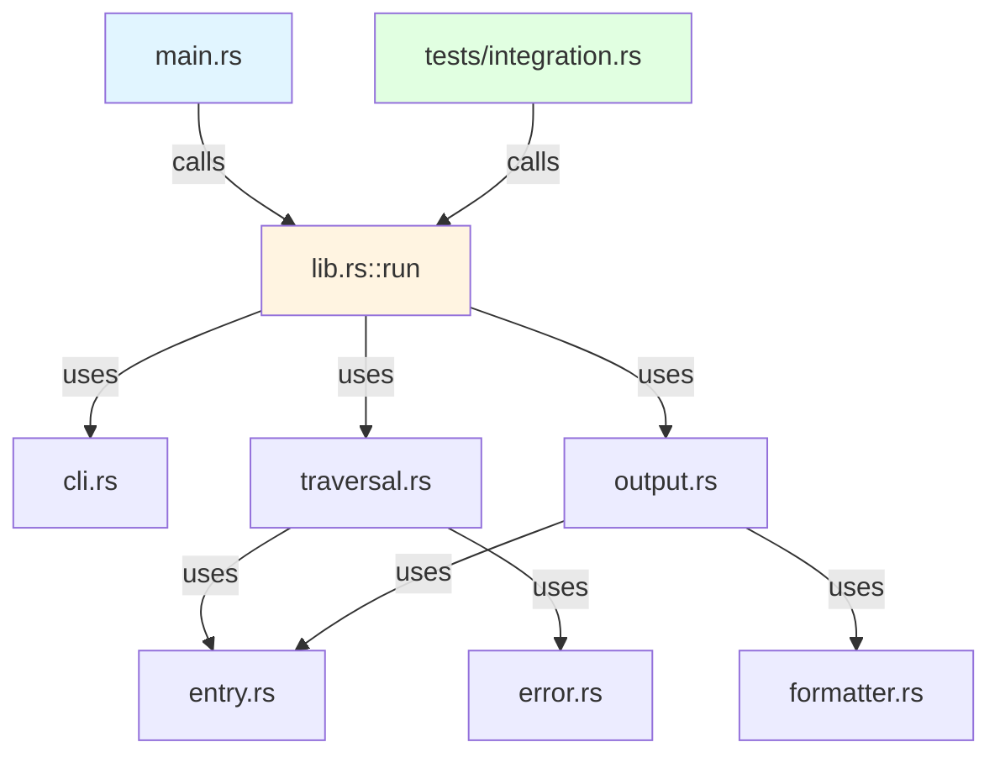
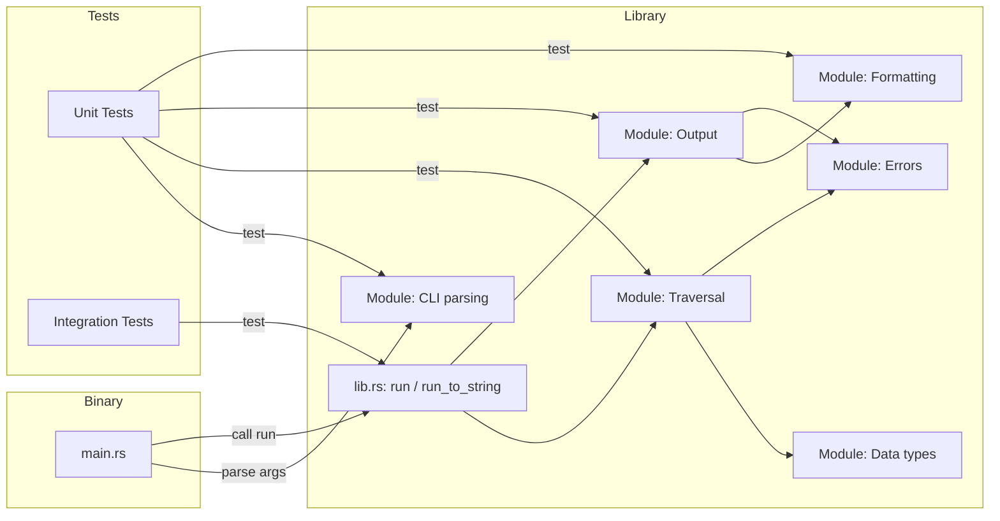
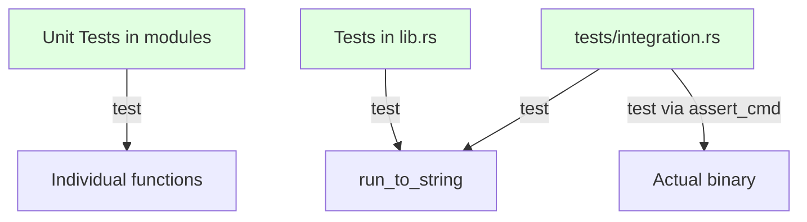

# ADR-002: Binary Crate with Library Structure

## Status

Accepted

## Context

Rust projects can be structured as:
1. Pure binary crates (only `main.rs`)
2. Pure library crates (only `lib.rs`)
3. Mixed crates (both `main.rs` and `lib.rs`)

We needed to decide on the project structure considering:
- Testability of business logic
- Reusability of disk usage analysis functionality
- Separation of CLI concerns from core logic
- Integration testing capabilities
- Documentation and API clarity

## Decision

We chose a **binary crate with library structure** where:



**Separation of concerns:**

- `main.rs`: Entry point, error handling, process exit
- `lib.rs`: Public API, orchestration, module declarations
- Core modules: Business logic, testable independently
- Integration tests: Call library functions directly

## Architecture



## Implementation Details

### main.rs Responsibilities

```rust
// Entry point only
fn main() {
    // 1. Parse CLI arguments
    // 2. Call lib::run()
    // 3. Handle errors
    // 4. Set exit code
}
```

### lib.rs Public API

```rust
pub fn run(args: &CliArgs) -> Result<(), DuskError>
pub fn run_to_string(args: &CliArgs) -> Result<String, DuskError>
```

The `run_to_string` variant enables:
- Integration testing without I/O
- Programmatic usage
- String-based assertions

## Consequences

### Positive

- **Testable**: Core logic testable without CLI wrapper
- **Reusable**: Library can be used by other Rust projects
- **Maintainable**: Clear separation between CLI and logic
- **Integration tests**: Can test end-to-end without spawning processes
- **Documentation**: Can generate library docs with `cargo doc`
- **Mockable**: Testing doesn't require filesystem access

### Negative

- **Slightly more complex**: Two entry points instead of one
- **Duplication risk**: Must keep `main.rs` and `lib.rs` in sync
- **Public API maintenance**: Library functions become public contract

### Neutral

- More files but clearer organization
- Module system exposed through `lib.rs`

## Testing Strategy



### Three Testing Levels

1. **Unit tests**: Test individual modules with `#[cfg(test)]`
2. **Library tests**: Test `run_to_string()` with various arguments
3. **Integration tests**: Test actual binary with `assert_cmd`

## Alternatives Considered

### Alternative 1: Pure Binary Crate

**Pros**: Simpler structure, single entry point
**Cons**: Difficult to test, not reusable, poor separation

**Why rejected**: Testability is critical for TDD approach

### Alternative 2: Pure Library Crate

**Pros**: Maximum reusability
**Cons**: No executable, users must write wrapper

**Why rejected**: Primary use case is CLI tool

### Alternative 3: Separate Binary and Library Crates

**Pros**: Complete separation
**Cons**: Workspace overhead, more complex project structure

**Why rejected**: Overkill for single-purpose tool

## Module Organization

The library structure enables clear module boundaries:

```
src/
  main.rs          ← Binary entry (minimal)
  lib.rs           ← Public API + orchestration
  cli.rs           ← CLI argument parsing
  entry.rs         ← Core data structures
  error.rs         ← Error types
  formatter.rs     ← Size formatting logic
  traversal.rs     ← Filesystem traversal
  output.rs        ← Terminal rendering
```

Each module has a single responsibility and can be tested independently.

## Public API Contract

The library exposes:

```rust
// Main functions
pub fn run(args: &CliArgs) -> Result<(), DuskError>
pub fn run_to_string(args: &CliArgs) -> Result<String, DuskError>

// CLI types
pub use cli::CliArgs;

// Error types
pub use error::DuskError;

// Re-exported types (if needed)
pub use entry::{DiskEntry, EntryType, SortOrder};
```

This minimal API keeps implementation details internal while enabling programmatic usage.

## Notes

- The `run_to_string` function is critical for testing without I/O
- Module visibility controlled via `pub` in `lib.rs`
- Integration tests verify actual binary behavior
- Unit tests verify individual component behavior
- This structure follows Rust ecosystem best practices
