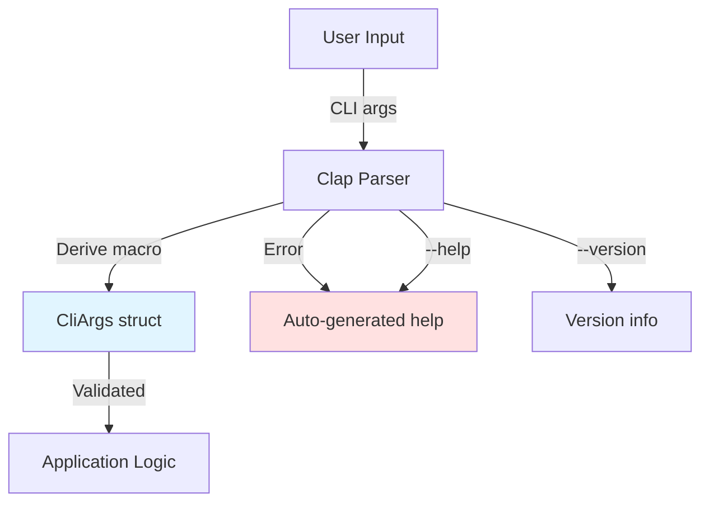
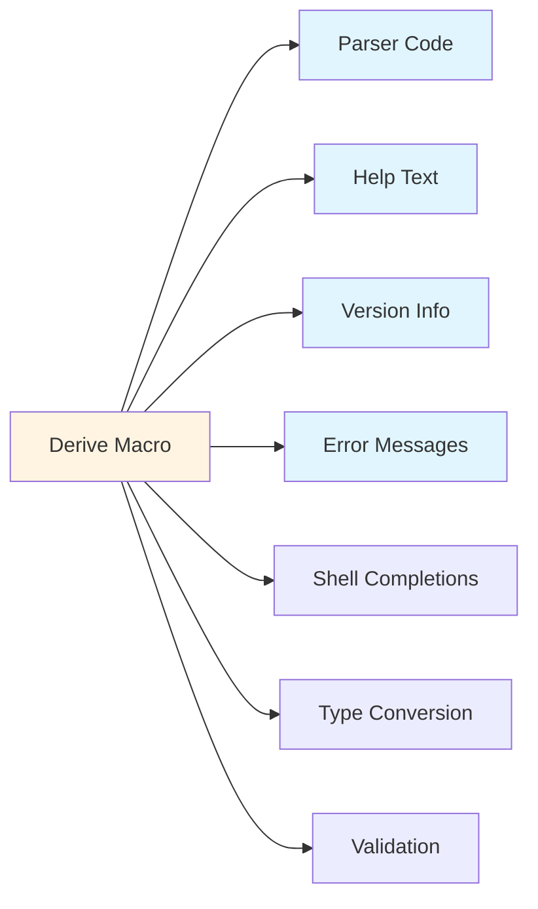

# ADR-003: CLI Framework Selection - Clap with Derive Macros

## Status

Accepted

## Context

The tool requires robust CLI argument parsing with:
- Multiple flags (`-H`, `-s`, `-a`, `-d`, `--no-color`)
- Flags with values (`--sort`, `--threads`, `--max-depth`)
- Multiple positional arguments (paths)
- Help generation
- Version information
- Input validation
- Type conversion

Available Rust CLI frameworks:
- **Clap**: Full-featured with derive macros or builder API
- **Structopt**: Predecessor to clap derive (now merged into clap)
- **Argh**: Minimal derive-based parser
- **Pico-args**: Bare-bones manual parsing
- **Manual parsing**: Using `std::env::args()`

## Decision

We selected **Clap v4 with derive macros** (`clap = { version = "4", features = ["derive"] }`).



## Implementation

### Derive-Based Struct

```rust
use clap::Parser;

#[derive(Parser, Debug)]
#[command(name = "disk-usage-clone")]
#[command(version, about = "A multi-threaded disk usage analyzer")]
pub struct CliArgs {
    /// Paths to analyze
    #[arg(default_value = ".")]
    pub paths: Vec<PathBuf>,

    /// Human-readable sizes (K, M, G)
    #[arg(short = 'H', long)]
    pub human_readable: bool,

    /// Display only totals
    #[arg(short, long)]
    pub summarize: bool,

    /// Maximum depth
    #[arg(short = 'd', long)]
    pub max_depth: Option<usize>,

    /// Show all files
    #[arg(short, long)]
    pub all: bool,

    /// Sort order
    #[arg(long, value_parser = parse_sort_order)]
    pub sort: Option<SortOrder>,

    /// Number of threads
    #[arg(short = 'j', long)]
    pub threads: Option<usize>,

    /// Disable colored output
    #[arg(long)]
    pub no_color: bool,
}
```

## Benefits of Derive Approach



## Consequences

### Positive

- **Type-safe**: Arguments typed at compile time
- **Self-documenting**: Help text generated from struct
- **Less boilerplate**: No manual parsing code
- **Validation**: Built-in validation for numbers, paths, etc.
- **Maintainable**: Changes to args only require struct updates
- **Auto-completion**: Can generate shell completions
- **Standard conventions**: Follows Unix CLI best practices
- **Error messages**: High-quality, helpful error messages

### Negative

- **Compile-time cost**: Proc macros increase build time
- **Dependency size**: Clap is a large dependency (~500KB)
- **Learning curve**: Derive macro attributes require learning
- **Less flexible**: Some edge cases harder than builder API

### Neutral

- Macro magic can be less transparent than explicit code
- Generated code not directly visible in source

## Feature Comparison

| Feature | Clap Derive | Manual | Argh | Pico-args |
|---------|------------|--------|------|-----------|
| Type safety | ✅ | ❌ | ✅ | ❌ |
| Help generation | ✅ | ❌ | ✅ | ❌ |
| Custom validation | ✅ | ✅ | ⚠️ | ⚠️ |
| Compile time | ⚠️ Slow | ✅ Fast | ✅ Fast | ✅ Fast |
| Binary size | ⚠️ Large | ✅ Small | ✅ Small | ✅ Small |
| Maintainability | ✅ | ❌ | ✅ | ⚠️ |
| Documentation | ✅ | ❌ | ⚠️ | ⚠️ |

## Custom Parsing Example

For non-standard types, we use custom parsers:

```rust
fn parse_sort_order(s: &str) -> Result<SortOrder, String> {
    match s {
        "size" => Ok(SortOrder::SizeDescending),
        "size-asc" => Ok(SortOrder::SizeAscending),
        "name" => Ok(SortOrder::Name),
        "none" => Ok(SortOrder::None),
        _ => Err(format!("Invalid sort order: {}", s)),
    }
}
```

## Generated Help Output

```
A multi-threaded disk usage analyzer

Usage: disk-usage-clone [OPTIONS] [PATHS]...

Arguments:
  [PATHS]...  Paths to analyze [default: .]

Options:
  -H, --human-readable     Human-readable sizes (K, M, G)
  -s, --summarize          Display only totals
  -d, --max-depth <DEPTH>  Maximum depth
  -a, --all                Show all files
      --sort <ORDER>       Sort order [possible values: size, size-asc, name, none]
  -j, --threads <N>        Number of threads
      --no-color           Disable colored output
  -h, --help               Print help
  -V, --version            Print version
```

## Alternatives Considered

### Alternative 1: Clap Builder API

**Pros**: More flexible, no proc macros
**Cons**: More verbose, less maintainable

**Why rejected**: Derive macros reduce boilerplate significantly

### Alternative 2: Argh

**Pros**: Smaller, faster compile
**Cons**: Less feature-rich, smaller ecosystem

**Why rejected**: Missing features like custom validators, less mature

### Alternative 3: Manual Parsing

**Pros**: No dependencies, full control, fastest compile
**Cons**: High maintenance, error-prone, poor UX

**Why rejected**: Time-consuming to implement correctly

### Alternative 4: Pico-args

**Pros**: Minimal, fast
**Cons**: No help generation, manual validation

**Why rejected**: Help text and validation are critical for UX

## Testing Strategy

Clap's derive macros enable easy testing:

```rust
#[test]
fn test_default_args() {
    let args = CliArgs::try_parse_from(&["disk-usage-clone"]).unwrap();
    assert_eq!(args.paths, vec![PathBuf::from(".")]);
    assert!(!args.human_readable);
    assert!(!args.summarize);
}

#[test]
fn test_human_readable_flag() {
    let args = CliArgs::try_parse_from(&["disk-usage-clone", "-H"]).unwrap();
    assert!(args.human_readable);
}
```

## Performance Considerations

- Clap parsing happens once at startup
- Runtime overhead negligible compared to I/O
- Binary size impact: ~500KB (acceptable for CLI tool)
- Compile time impact: ~2-3 seconds (acceptable)

## Future Extensibility

The derive approach makes it easy to add new arguments:

```rust
// Just add a field!
#[arg(long)]
pub follow_symlinks: bool,
```

Clap handles:
- Adding to help text
- Parsing the flag
- Type conversion
- Validation

## Notes

- Clap v4 is the current stable version
- Derive macros merged from deprecated structopt
- Industry standard in Rust CLI ecosystem
- Well-maintained with active community
- Excellent documentation and examples
