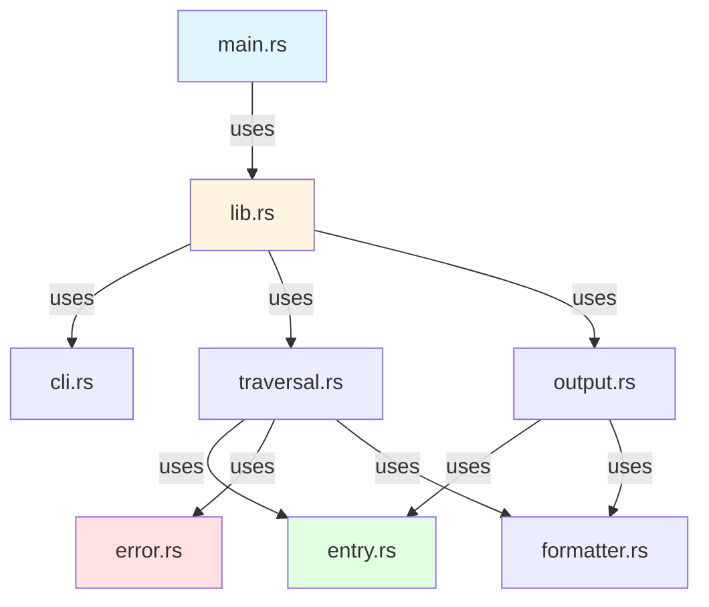
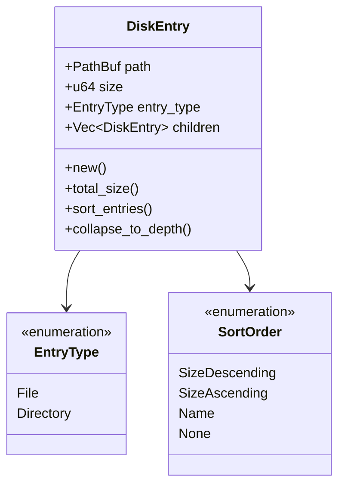
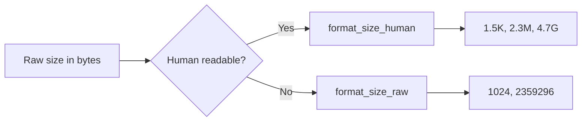
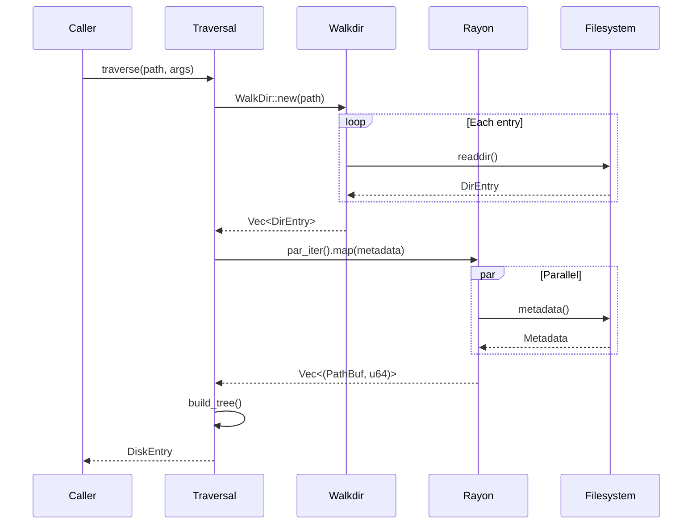
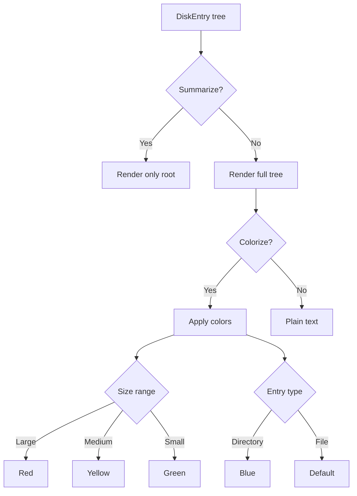
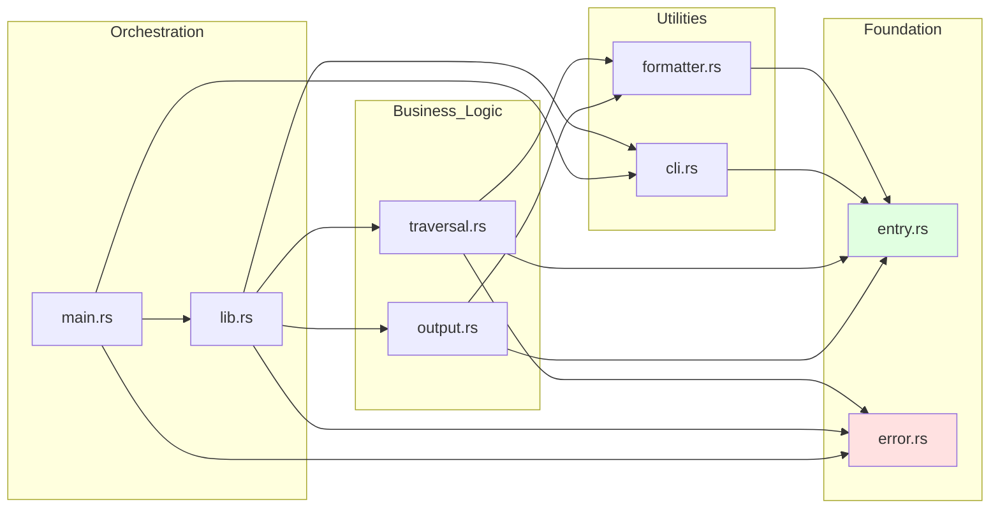
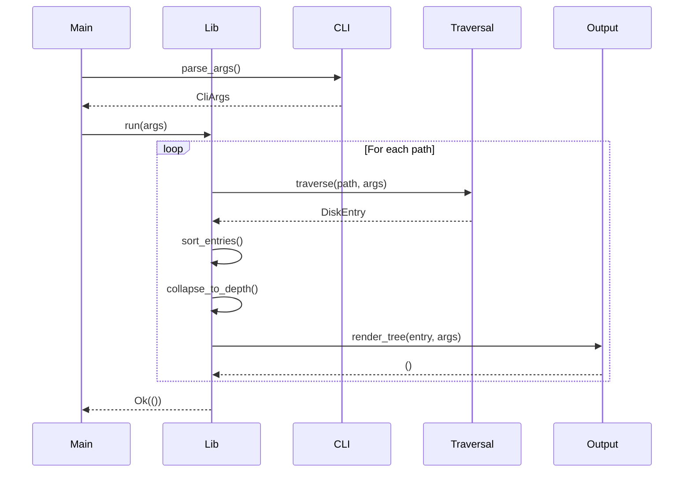

# ADR-004: Module Organization and Dependency Flow

## Status

Accepted

## Context

A well-organized module structure is critical for:
- Maintainability as the codebase grows
- Clear separation of concerns
- Testability of individual components
- Understanding data and control flow
- Avoiding circular dependencies
- Onboarding new contributors

We needed to decide:
- How to split functionality into modules
- What dependencies are allowed between modules
- How to organize the module hierarchy
- What belongs in each module

## Decision

We organized the codebase into **seven focused modules** with clear responsibilities and a unidirectional dependency flow.



## Module Responsibilities

### Layer 1: Foundation (No internal dependencies)

#### entry.rs - Core Data Structures


**Responsibilities:**
- Define `DiskEntry` tree structure
- Define `EntryType` and `SortOrder` enums
- Provide tree manipulation methods
- Sorting and depth-collapsing logic

**Dependencies:** None (pure data structures)

#### error.rs - Error Types
```rust
pub enum DuskError {
    IoError(String),
    PathNotFound(String),
    PermissionDenied(String),
    TraversalError(String),
}
```

**Responsibilities:**
- Define application error types
- Implement Display and From traits
- Convert from std::io::Error

**Dependencies:** None (error types only)

### Layer 2: Utilities (Depend on foundation)

#### formatter.rs - Size Formatting


**Responsibilities:**
- Format sizes as human-readable strings (K, M, G, T)
- Format sizes as raw byte counts
- Pad sizes for alignment
- Format complete entry lines with indentation

**Dependencies:** `entry.rs` (uses DiskEntry)

#### cli.rs - CLI Parsing
```rust
#[derive(Parser)]
pub struct CliArgs {
    pub paths: Vec<PathBuf>,
    pub human_readable: bool,
    pub summarize: bool,
    pub max_depth: Option<usize>,
    pub all: bool,
    pub sort: Option<SortOrder>,
    pub threads: Option<usize>,
    pub no_color: bool,
}
```

**Responsibilities:**
- Define CLI argument structure
- Use clap derive macros for parsing
- Custom parsers for enums
- Default values

**Dependencies:** `entry.rs` (uses SortOrder)

### Layer 3: Business Logic (Depend on utilities)

#### traversal.rs - Filesystem Traversal


**Responsibilities:**
- Traverse filesystem with walkdir
- Parallel metadata collection with rayon
- Build DiskEntry tree structure
- Handle max-depth and path filtering
- Error handling for filesystem operations

**Dependencies:**
- `entry.rs` (creates DiskEntry)
- `error.rs` (returns DuskError)

#### output.rs - Terminal Rendering


**Responsibilities:**
- Render DiskEntry tree to terminal
- Apply colorization based on size and type
- Handle --no-color flag
- Recursive tree rendering with indentation
- Filter files based on --all flag

**Dependencies:**
- `entry.rs` (traverses DiskEntry)
- `formatter.rs` (formats sizes)

### Layer 4: Orchestration

#### lib.rs - Public API
```rust
pub fn run(args: &CliArgs) -> Result<(), DuskError> {
    // 1. Traverse each path
    // 2. Sort if requested
    // 3. Collapse to max-depth
    // 4. Render output
}

pub fn run_to_string(args: &CliArgs) -> Result<String, DuskError> {
    // Same as run but returns String
}
```

**Responsibilities:**
- Public API functions
- Module declarations
- Orchestrate traversal → processing → output flow
- Handle multiple paths
- Apply sorting and depth limiting

**Dependencies:** All modules (orchestration layer)

#### main.rs - Entry Point
```rust
fn main() {
    // 1. Parse arguments
    // 2. Call lib::run()
    // 3. Handle errors
    // 4. Set exit code
}
```

**Responsibilities:**
- Binary entry point
- Error formatting for user
- Process exit code

**Dependencies:** `lib.rs`, `cli.rs`, `error.rs`

## Dependency Flow Diagram



## Consequences

### Positive

- **Clear boundaries**: Each module has a single responsibility
- **Testable**: Modules testable independently
- **No circular dependencies**: Unidirectional flow
- **Easy to navigate**: Logic grouped by purpose
- **Maintainable**: Changes localized to relevant modules
- **Extensible**: New features have clear placement

### Negative

- **More files**: Seven modules instead of one large file
- **Import overhead**: Need to declare module relationships
- **Learning curve**: New contributors must understand structure

### Neutral

- Module boundaries may shift as features are added
- Some modules (like formatter) are small but separate for clarity

## Module Interaction Example



## Design Principles Applied

1. **Single Responsibility**: Each module has one clear purpose
2. **Dependency Inversion**: High-level modules don't depend on implementation details
3. **Layered Architecture**: Clear layers with unidirectional dependencies
4. **Separation of Concerns**: I/O, logic, and presentation separated

## Testing Strategy per Module

| Module | Unit Tests | Integration Tests |
|--------|-----------|-------------------|
| entry.rs | ✅ Data structure methods | ❌ |
| error.rs | ✅ Display formatting | ❌ |
| formatter.rs | ✅ Size formatting | ❌ |
| cli.rs | ✅ Argument parsing | ❌ |
| traversal.rs | ✅ Tree building | ✅ Filesystem access |
| output.rs | ✅ Rendering logic | ❌ |
| lib.rs | ✅ Orchestration | ✅ End-to-end |

## Alternatives Considered

### Alternative 1: Flat Structure (All in lib.rs)

**Pros**: Simpler, fewer files
**Cons**: Poor separation, hard to test, not maintainable

**Why rejected**: Doesn't scale beyond toy projects

### Alternative 2: Feature-Based Modules

```
src/
  disk_analysis/
    mod.rs
    traversal.rs
    tree.rs
  formatting/
    mod.rs
    colors.rs
    sizes.rs
```

**Pros**: Groups related features
**Cons**: More complex hierarchy, harder to navigate

**Why rejected**: Overkill for current size, can refactor later if needed

### Alternative 3: Domain-Driven Design

**Pros**: Models business domain
**Cons**: Over-engineering for CLI tool

**Why rejected**: Unnecessary complexity for straightforward tool

## Future Considerations

As the project grows, we may need to:
- Split `output.rs` into rendering and colorization
- Add a `config.rs` for configuration file support
- Create a `cache.rs` for caching traversal results
- Add a `filter.rs` for complex filtering logic

The current structure supports these additions without major refactoring.

## Notes

- Dependencies between modules are enforced by Rust's module system
- Circular dependencies cause compilation errors (good!)
- Each module has comprehensive unit tests
- Integration tests verify module interactions
- Module boundaries optimized for testability
