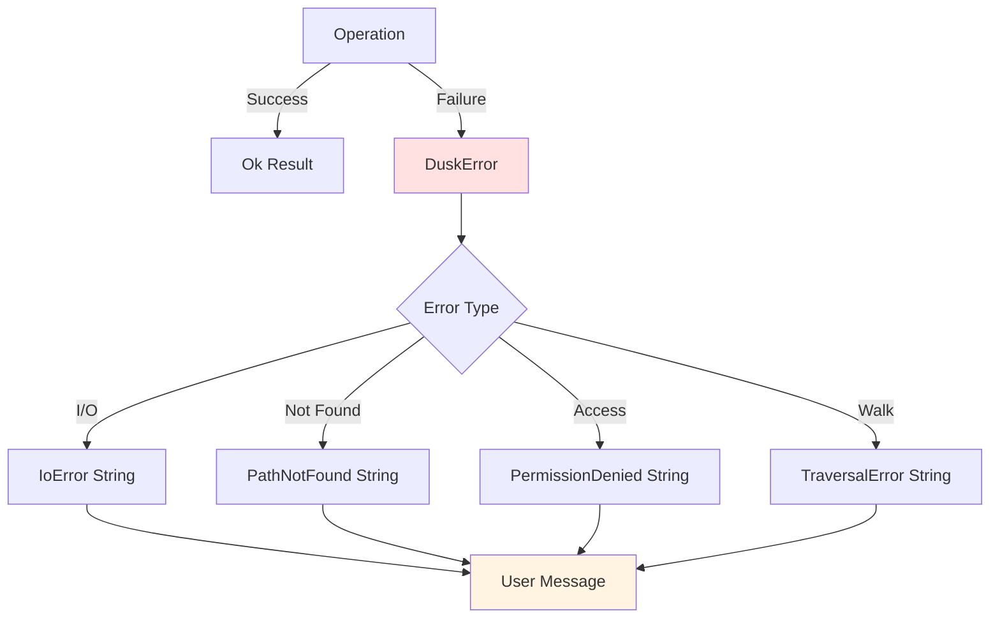
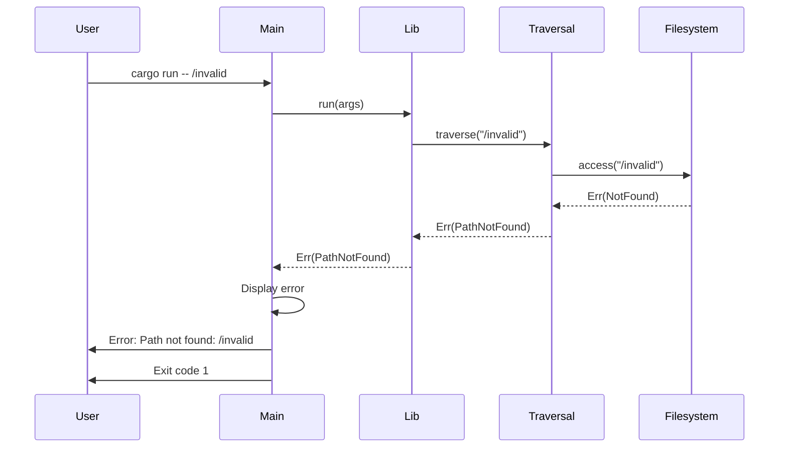
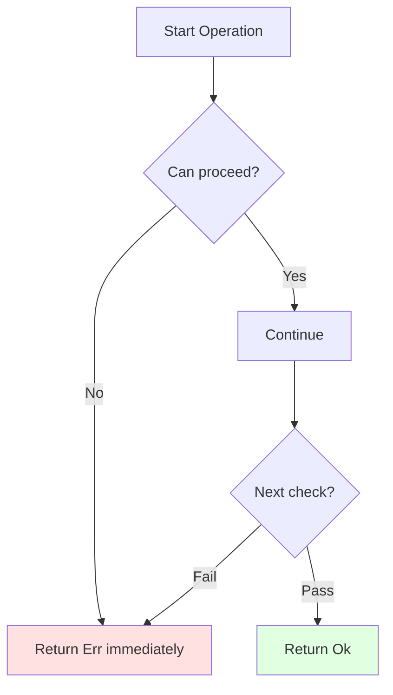
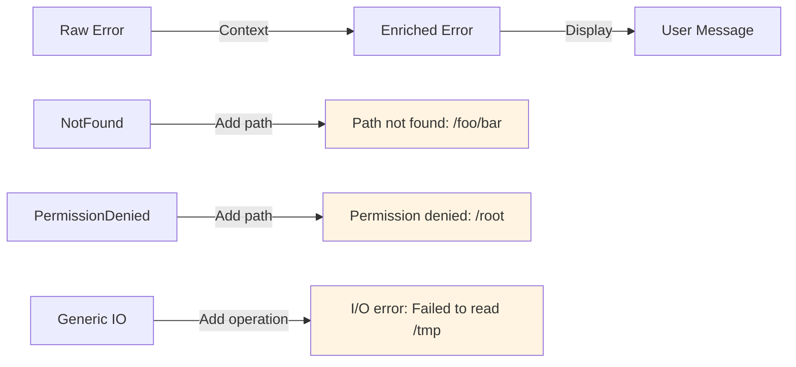
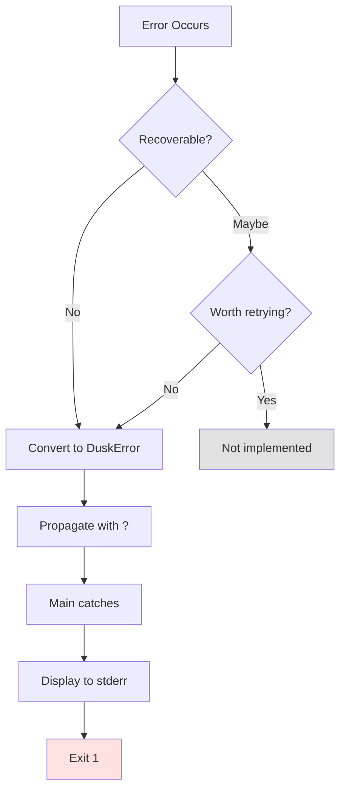

# ADR-005: Error Handling Strategy

## Status

Accepted

## Context

Disk usage analysis involves multiple error scenarios:
- File/directory not found
- Permission denied errors
- I/O errors during traversal
- Invalid CLI arguments
- Metadata access failures

We needed to decide:
- Error representation (custom enum vs external crate)
- Error propagation strategy
- User-facing error messages
- Error recovery vs fail-fast approach
- Integration with Rust's Result type

## Decision

We implemented a **custom error enum with fail-fast semantics** using Rust's native error handling.



## Error Type Definition

```rust
#[derive(Debug)]
pub enum DuskError {
    /// Generic I/O error with context
    IoError(String),

    /// Path does not exist
    PathNotFound(String),

    /// Insufficient permissions
    PermissionDenied(String),

    /// Error during directory traversal
    TraversalError(String),
}
```

## Error Flow Architecture



## Implementation Details

### Display Trait for User Messages

```rust
impl Display for DuskError {
    fn fmt(&self, f: &mut std::fmt::Formatter<'_>) -> std::fmt::Result {
        match self {
            DuskError::IoError(msg) => write!(f, "I/O error: {}", msg),
            DuskError::PathNotFound(path) => write!(f, "Path not found: {}", path),
            DuskError::PermissionDenied(path) => write!(f, "Permission denied: {}", path),
            DuskError::TraversalError(msg) => write!(f, "Traversal error: {}", msg),
        }
    }
}
```

### From Trait for Error Conversion

```rust
impl From<std::io::Error> for DuskError {
    fn from(err: std::io::Error) -> Self {
        match err.kind() {
            ErrorKind::NotFound => DuskError::PathNotFound(err.to_string()),
            ErrorKind::PermissionDenied => DuskError::PermissionDenied(err.to_string()),
            _ => DuskError::IoError(err.to_string()),
        }
    }
}
```

### Error Propagation with ? Operator

```rust
pub fn traverse(path: &Path, args: &CliArgs) -> Result<DiskEntry, DuskError> {
    // ? operator converts std::io::Error to DuskError automatically
    let metadata = path.metadata()?;

    // Explicit error context
    if !path.exists() {
        return Err(DuskError::PathNotFound(
            path.display().to_string()
        ));
    }

    // Continue processing...
}
```

## Error Handling Patterns

### Pattern 1: Fail Fast



We don't attempt recovery - errors propagate immediately to main.

### Pattern 2: Error Enrichment

```rust
// Convert generic error to domain-specific error with context
std::fs::read_dir(path)
    .map_err(|e| DuskError::TraversalError(
        format!("Failed to read directory {}: {}", path.display(), e)
    ))?
```

### Pattern 3: Error Aggregation (Not Used)

We **don't** collect partial results on error:
- First error stops processing
- No "best effort" output
- Clear failure semantics

## Error Message Quality



Good error messages include:
- **What** happened (error type)
- **Where** it happened (file path)
- **Why** it happened (underlying cause)

Example:
```
❌ Bad:  "IO error"
✅ Good: "I/O error: Failed to read directory /foo/bar: Permission denied"
```

## Consequences

### Positive

- **Type-safe**: Errors are typed and checked at compile time
- **Clear intent**: Error variants document failure modes
- **User-friendly**: Display trait provides good error messages
- **Composable**: Integrates with ? operator and Result
- **Debuggable**: Debug trait for development
- **No unwrap**: No panics in production code
- **Explicit handling**: Callers must handle errors

### Negative

- **String allocation**: Error messages allocate strings
- **No backtraces**: Would need external crate (anyhow/eyre)
- **Manual From impls**: Need to write conversion code
- **Less context**: No automatic error chain tracking

### Neutral

- Custom enum vs external crate trade-off
- Fail-fast means partial results not available

## Error Handling Decision Tree



Currently, no errors are considered recoverable.

## Testing Error Handling

```rust
#[test]
fn test_nonexistent_path() {
    let args = CliArgs {
        paths: vec![PathBuf::from("/nonexistent/path")],
        ..Default::default()
    };

    let result = run(&args);
    assert!(result.is_err());
    assert!(matches!(result.unwrap_err(), DuskError::PathNotFound(_)));
}

#[test]
fn test_error_display() {
    let error = DuskError::PathNotFound("/foo".to_string());
    assert_eq!(
        error.to_string(),
        "Path not found: /foo"
    );
}
```

## Alternatives Considered

### Alternative 1: anyhow/eyre

**Pros**:
- Automatic backtraces
- Error context chaining
- Ergonomic error handling

**Cons**:
- External dependency
- Type erasure (loses error type info)
- Larger binary size

**Why rejected**: Custom enum provides sufficient error handling for our use case. Can add later if needed.

### Alternative 2: thiserror

**Pros**:
- Derives Display and Error traits
- Less boilerplate
- Type-safe like custom enum

**Cons**:
- Additional dependency
- Proc macro compile time

**Why rejected**: Our error enum is simple enough that manual implementation is clearer.

### Alternative 3: String Errors

**Pros**: Simplest possible approach
**Cons**: Not type-safe, poor error handling

**Why rejected**: Loses type information and pattern matching ability.

### Alternative 4: Panic on Error

**Pros**: Simplest implementation
**Cons**: Poor UX, can't recover, loses information

**Why rejected**: Violates Rust best practices, terrible UX.

## Error Recovery Strategy

Currently: **Fail fast, no recovery**

```rust
// If any path fails, entire program stops
for path in &args.paths {
    let entry = traverse(path, args)?; // Fails on first error
    render_tree(&entry, args);
}
```

Future consideration: **Continue on error**

```rust
// Could collect errors and continue
for path in &args.paths {
    match traverse(path, args) {
        Ok(entry) => render_tree(&entry, args),
        Err(e) => eprintln!("Warning: {}", e), // Continue with next path
    }
}
```

Not implemented because:
- Simpler semantics
- Clear failure indication
- Consistent with Unix tools (du fails fast)

## Error Types Breakdown

| Error Type | When It Occurs | User Action |
|------------|----------------|-------------|
| `PathNotFound` | Path doesn't exist | Check path spelling |
| `PermissionDenied` | No read access | Run with sudo or check permissions |
| `IoError` | Generic I/O failure | Check disk, filesystem, etc. |
| `TraversalError` | Directory walk fails | Check filesystem integrity |

## Integration with Main

```rust
fn main() {
    let args = CliArgs::parse();

    if let Err(e) = disk_usage_clone::run(&args) {
        eprintln!("Error: {}", e);
        std::process::exit(1);
    }
}
```

Clean separation:
- Library returns Result
- Main handles error display and exit code
- No direct printing in library code (except run())

## Future Enhancements

Potential improvements:
- Add error codes for programmatic handling
- Implement Error trait for integration with other tools
- Add context chaining for nested operations
- Collect warnings without failing
- JSON error output mode

## Notes

- All functions returning Result use DuskError
- No .unwrap() or .expect() in production code
- Error messages tested for correct formatting
- Display trait provides user-facing messages
- Debug trait provides developer information
- Exit code 1 indicates failure (Unix convention)
