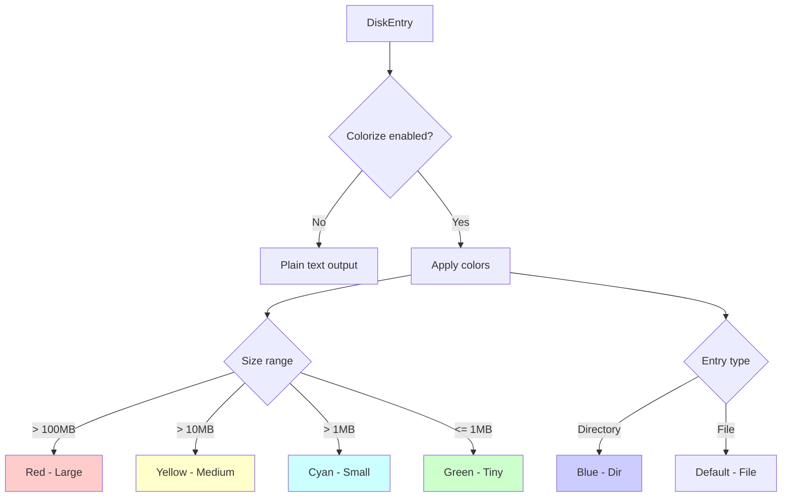
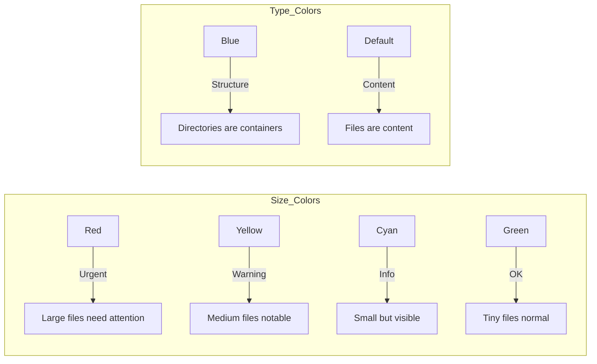
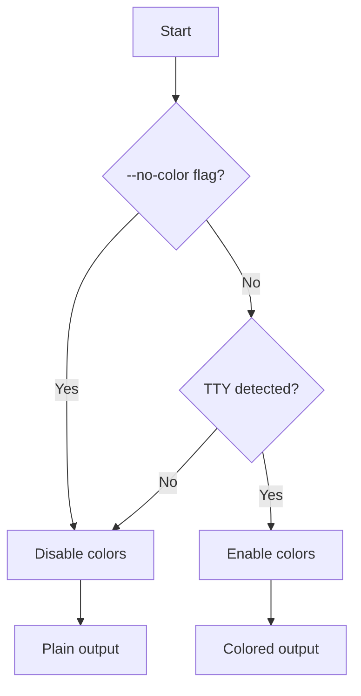
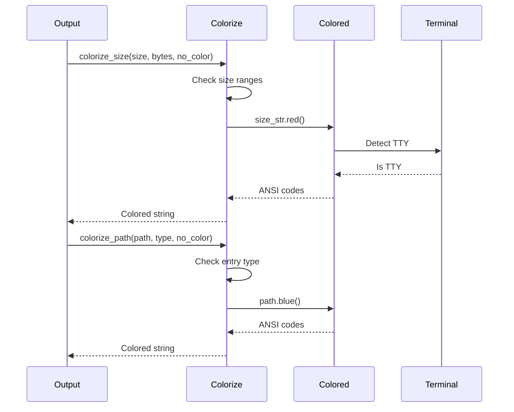
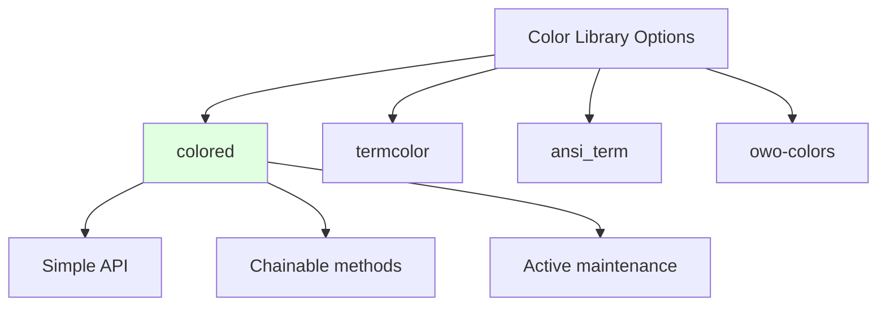

# ADR-006: Output Colorization Strategy

## Status

Accepted

## Context

Terminal output readability is critical for quickly identifying:
- Large files/directories (potential cleanup targets)
- Directory vs file distinction
- Size magnitude at a glance

We needed to decide:
- Whether to colorize output at all
- What to colorize (sizes, paths, both)
- Color scheme for size ranges
- Color scheme for entry types
- Library vs manual ANSI codes
- Terminal detection and --no-color flag

## Decision

We implemented **semantic colorization** using the `colored` crate with size-based and type-based color schemes.



## Color Scheme

### Size-Based Colors

```rust
pub fn colorize_size(size_str: &str, size_bytes: u64, no_color: bool) -> String {
    if no_color {
        return size_str.to_string();
    }

    match size_bytes {
        s if s > 100_000_000 => size_str.red().to_string(),      // >100MB: Red (large)
        s if s > 10_000_000  => size_str.yellow().to_string(),   // >10MB:  Yellow (medium)
        s if s > 1_000_000   => size_str.cyan().to_string(),     // >1MB:   Cyan (notable)
        _                    => size_str.green().to_string(),    // ≤1MB:   Green (small)
    }
}
```

### Type-Based Colors

```rust
pub fn colorize_path(path: &str, entry_type: &EntryType, no_color: bool) -> String {
    if no_color {
        return path.to_string();
    }

    match entry_type {
        EntryType::Directory => path.blue().to_string(),   // Directories: Blue
        EntryType::File => path.to_string(),               // Files: Default
    }
}
```

## Visual Examples

```
193.3M  /target/debug/deps              (Red, Blue)
13.4M   /target/debug/incremental       (Yellow, Blue)
3.2M    /target/debug/build             (Cyan, Blue)
570.4K  /src/main.rs                    (Green, Default)
```

## Color Palette Rationale



**Size colors** follow traffic light semantics:
- 🔴 Red = Stop and look (cleanup candidates)
- 🟡 Yellow = Caution (worth examining)
- 🔵 Cyan = Information (noticeable)
- 🟢 Green = Go (normal small files)

**Type colors** follow filesystem conventions:
- Blue for directories (common in ls, tree, etc.)
- Default for files

## Terminal Detection



The `colored` crate automatically:
- Detects if stdout is a TTY
- Disables colors when piped to file
- Respects NO_COLOR environment variable
- Handles Windows terminal compatibility

## Implementation Architecture



## Consequences

### Positive

- **Readability**: Large files immediately obvious
- **Semantic**: Colors have meaning, not just decoration
- **Accessible**: Can be disabled for accessibility needs
- **Standard**: Follows Unix tool conventions (ls, tree)
- **Automatic**: TTY detection just works
- **Cross-platform**: Works on Windows, Linux, macOS
- **Pipeable**: Automatically disables when piped

### Negative

- **Dependency**: Adds `colored` crate (~100KB)
- **Subjective**: Color choices may not suit all users
- **Accessibility**: Some color schemes hard for colorblind users
- **Not configurable**: Fixed color scheme

### Neutral

- Colors are aesthetic preference
- Could support custom themes in future

## Color Accessibility

Current scheme has some considerations:

| Issue | Mitigation |
|-------|-----------|
| Red-green colorblind | Sizes have different prefixes (K, M, G) |
| Blue-yellow colorblind | Type indicated by trailing / in some outputs |
| Fully colorblind | --no-color flag available |
| Low contrast | Bold could be added for emphasis |

Future enhancement: Support alternative color schemes.

## The colored Crate

**Why `colored`?**



**Pros**:
- Simple, ergonomic API
- Automatic TTY detection
- Cross-platform
- Active maintenance
- Small dependency

**Cons**:
- Not as flexible as termcolor
- Fixed color set

## Size Threshold Reasoning

| Threshold | Rationale |
|-----------|-----------|
| 100MB | Definitely large, cleanup candidate |
| 10MB | Notable size, worth investigating |
| 1MB | Small but visible, normal for binaries |
| < 1MB | Typical file size, no concern |

These thresholds work well for:
- Source code projects
- Build artifacts
- General filesystem analysis

Could be configurable in future.

## Alternatives Considered

### Alternative 1: No Colorization

**Pros**: Simpler, no dependencies
**Cons**: Harder to scan output visually

**Why rejected**: Colorization significantly improves UX

### Alternative 2: termcolor

**Pros**: More flexible, granular control
**Cons**: More verbose API, manual TTY handling

**Why rejected**: `colored` simpler for our needs

### Alternative 3: Manual ANSI Codes

**Pros**: No dependency, full control
**Cons**: Platform-specific, error-prone, reinventing wheel

**Why rejected**: `colored` crate solves this better

### Alternative 4: Rich UI (TUI)

**Pros**: Interactive, more information
**Cons**: Much more complex, different use case

**Why rejected**: We want simple, pipeable output like `du`

## Testing Colorization

```rust
#[test]
fn test_colorize_size_ranges() {
    // Large (>100MB) - Red
    let large = colorize_size("150M", 150_000_000, false);
    assert!(large.contains("\x1b[")); // Contains ANSI codes

    // Disabled
    let plain = colorize_size("150M", 150_000_000, true);
    assert_eq!(plain, "150M"); // No ANSI codes
}

#[test]
fn test_colorize_path_variants() {
    let dir = colorize_path("/foo", &EntryType::Directory, false);
    assert!(dir.contains("\x1b[")); // Blue ANSI codes

    let file = colorize_path("/foo", &EntryType::File, false);
    assert!(!file.contains("\x1b[")); // No codes (default color)
}
```

## Performance Considerations

- String allocation for colored output
- Negligible compared to I/O operations
- TTY detection happens once per output

## User Control

```bash
# Enable colors (default when TTY)
cargo run -- -H

# Disable colors explicitly
cargo run -- -H --no-color

# Disable via environment variable
NO_COLOR=1 cargo run -- -H

# Automatically disabled when piped
cargo run -- -H > output.txt  # No colors in file
```

## Output Comparison

### With Colors (Terminal)
```
193.3M  /target/debug/deps              # Red, Blue
13.4M   /target/debug/incremental       # Yellow, Blue
570.4K  /src/main.rs                    # Green, Default
```

### Without Colors (Piped/--no-color)
```
193.3M  /target/debug/deps
13.4M   /target/debug/incremental
570.4K  /src/main.rs
```

## Future Enhancements

Potential improvements:
- Custom color themes via config file
- More granular size thresholds
- Accessibility-focused color schemes
- Highlight pattern matching
- Progress bar during traversal (with indicatif)

## Integration with Other Tools

Colors automatically disabled when:
- Piped to other commands: `disk-usage-clone | grep foo`
- Redirected to file: `disk-usage-clone > output.txt`
- Scripting contexts
- CI/CD environments (usually)

This ensures output is clean for programmatic processing.

## Notes

- `colored` crate respects NO_COLOR environment variable
- ANSI escape codes are standard across Unix systems
- Windows support via colored's Windows API integration
- Colors can be tested by checking for ANSI escape sequences
- --no-color flag takes precedence over all auto-detection
