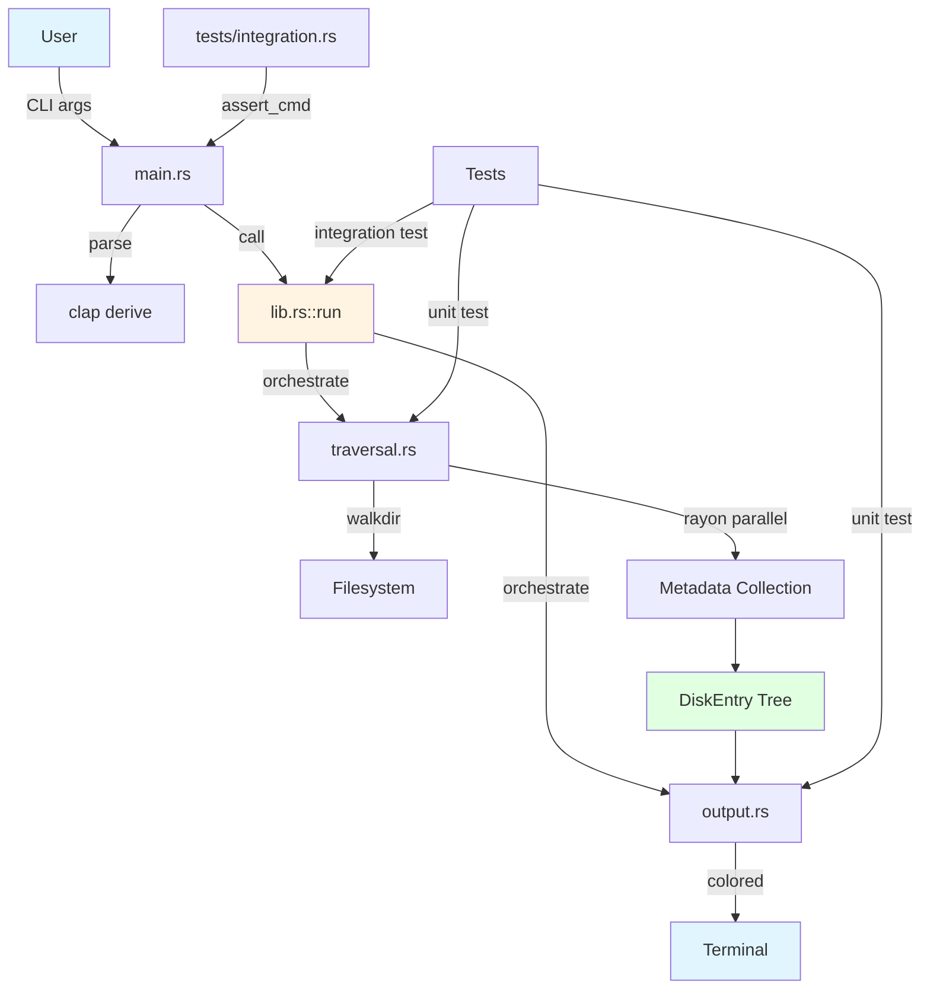

# Architecture Decision Records (ADRs)

This directory contains Architecture Decision Records for the disk-usage-clone project. ADRs document the key architectural decisions made during development, including context, alternatives considered, and consequences.

## What is an ADR?

An Architecture Decision Record (ADR) captures an important architectural decision made along with its context and consequences. ADRs help:
- Understand why decisions were made
- Onboard new contributors
- Evaluate trade-offs when revisiting decisions
- Document alternatives that were considered

## ADR Format

Each ADR follows this structure:
- **Title**: Brief description of the decision
- **Status**: Accepted, Proposed, Deprecated, Superseded
- **Context**: Problem being solved and constraints
- **Decision**: What was decided and why
- **Consequences**: Positive, negative, and neutral outcomes
- **Alternatives Considered**: Other options and why they were rejected

## Index

### [ADR-001: Multi-Threading Strategy](./001-multi-threading-strategy.md)
**Status**: Accepted

**Summary**: Documents the decision to use walkdir for single-threaded directory traversal combined with rayon for parallel metadata collection. Explains the hybrid approach and why it provides the best performance characteristics.

**Key Topics**:
- Walkdir vs parallel traversal
- Rayon work-stealing
- Thread pool configuration
- Performance trade-offs

---

### [ADR-002: Binary with Library Structure](./002-binary-with-library-structure.md)
**Status**: Accepted

**Summary**: Documents the decision to structure the project as a binary crate with a library component, enabling testability and reusability while maintaining a CLI-first design.

**Key Topics**:
- main.rs vs lib.rs separation
- Public API design
- Testing strategy
- Module organization

---

### [ADR-003: CLI Framework Selection](./003-cli-framework-selection.md)
**Status**: Accepted

**Summary**: Documents the decision to use Clap v4 with derive macros for CLI argument parsing, providing type-safe, maintainable argument handling with excellent user experience.

**Key Topics**:
- Clap vs alternatives
- Derive macros vs builder API
- Help generation
- Type safety

---

### [ADR-004: Module Organization](./004-module-organization.md)
**Status**: Accepted

**Summary**: Documents the module structure with clear layering and unidirectional dependencies. Explains the responsibility of each module and how they interact.

**Key Topics**:
- Seven-module structure
- Dependency flow
- Separation of concerns
- Testing boundaries

---

### [ADR-005: Error Handling Strategy](./005-error-handling-strategy.md)
**Status**: Accepted

**Summary**: Documents the decision to use a custom error enum with fail-fast semantics, providing type-safe error handling and clear error messages without external dependencies.

**Key Topics**:
- Custom error enum
- Display trait implementation
- Fail-fast vs recovery
- Error message quality

---

### [ADR-006: Output Colorization Strategy](./006-output-colorization-strategy.md)
**Status**: Accepted

**Summary**: Documents the decision to use semantic colorization with the `colored` crate, improving readability while maintaining compatibility with pipes and scripts.

**Key Topics**:
- Size-based color scheme
- Type-based colors
- Terminal detection
- Accessibility considerations

---

## Decision Status

| Status | Count | ADRs |
|--------|-------|------|
| Accepted | 6 | 001, 002, 003, 004, 005, 006 |
| Proposed | 0 | - |
| Deprecated | 0 | - |
| Superseded | 0 | - |

## Reading Guide

### For New Contributors

Start with these ADRs to understand the project structure:
1. [ADR-002: Binary with Library Structure](./002-binary-with-library-structure.md)
2. [ADR-004: Module Organization](./004-module-organization.md)
3. [ADR-001: Multi-Threading Strategy](./001-multi-threading-strategy.md)

### For Performance Questions

Read these ADRs:
- [ADR-001: Multi-Threading Strategy](./001-multi-threading-strategy.md)
- [ADR-004: Module Organization](./004-module-organization.md)

### For Testing and Maintainability

Read these ADRs:
- [ADR-002: Binary with Library Structure](./002-binary-with-library-structure.md)
- [ADR-005: Error Handling Strategy](./005-error-handling-strategy.md)

### For CLI and UX

Read these ADRs:
- [ADR-003: CLI Framework Selection](./003-cli-framework-selection.md)
- [ADR-006: Output Colorization Strategy](./006-output-colorization-strategy.md)

## Key Architectural Principles

These principles guided our decisions:

1. **Simplicity over Cleverness**: Choose boring, obvious solutions
2. **Performance Matters**: Multi-threading where it helps, simple where it doesn't
3. **Testability**: Structure enables comprehensive testing
4. **Unix Philosophy**: Do one thing well, compose with other tools
5. **User Experience**: Good error messages, helpful defaults, visual feedback

## Architectural Overview



## Technology Stack Summary

| Component | Technology | ADR |
|-----------|-----------|-----|
| Directory traversal | walkdir | ADR-001 |
| Parallelization | rayon | ADR-001 |
| CLI parsing | clap v4 derive | ADR-003 |
| Output colorization | colored | ADR-006 |
| Error handling | Custom enum | ADR-005 |
| Testing | cargo test + assert_cmd | ADR-002 |
| Project structure | Binary + Library | ADR-002 |

## Contributing

When making significant architectural changes:

1. **Create a new ADR**: Document the decision before implementing
2. **Use the next number**: ADR-007, ADR-008, etc.
3. **Include diagrams**: Use Mermaid.js for visual explanations
4. **Consider alternatives**: Document what was considered and why
5. **Update this README**: Add your ADR to the index

### ADR Template

```markdown
# ADR-XXX: Title

## Status
Proposed | Accepted | Deprecated | Superseded

## Context
What problem are we solving?

## Decision
What did we decide?

## Consequences
### Positive
### Negative
### Neutral

## Alternatives Considered
### Alternative 1
**Pros**: ...
**Cons**: ...
**Why rejected**: ...
```

## Resources

- [ADR GitHub Organization](https://adr.github.io/)
- [Documenting Architecture Decisions](https://cognitect.com/blog/2011/11/15/documenting-architecture-decisions)
- [Mermaid.js Documentation](https://mermaid.js.org/)

## Questions?

If you have questions about any architectural decision:
1. Read the relevant ADR
2. Check if an alternative you're considering was already discussed
3. Open an issue if you think a decision should be revisited
4. Propose a new ADR if you have a better approach

## Future ADRs

Potential topics for future ADRs:
- Configuration file support
- Caching strategy for repeated traversals
- Progress bar implementation
- JSON output format
- Plugin system for custom formatters
- Symlink handling strategy
